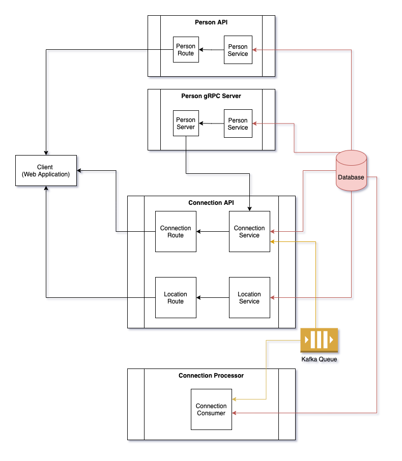

# Microservice Architecture
## Diagram

## Components
1. Database
1. Kafka
1. Webapp/UI
1. Connection Microservice
1. Person Microservice
1. Connection Processor

### Postgres Database
Relational database to persist person and location data. Connection Microservice, Person Microservice and Connection Processor interacts with this database for CRUD operations on People and Location data.

### Kafka
Kafka to enable asynchronous processing of location data, this will enable the location data to be ingested at a large scale.  Connection Microservice and Connection Processor interacts with Kafka to ingest and process Location data.

### Webapp/UI
Webapp/UI to display the person and connection data.  Webapp/UI invokes Connection API and Person API to retrieve People and Connection data.

### Connection Microservice
Connection Microservice provides the APIs to ingest location data and retrieve connections.  This Microservice invokes Person Microservice to retrieve all Person data points.  This Microservice also provides an API to create Location data, this Location data is enqueued in Kafka and returns immediately, this enables Location data to be rapidly ingested, which is expected during conferences.  

### People Microservice
People Microservice interacts with the Postgres database and provides CRUD operations for People data, this is a stand-alone Microservice. This Microservice is invoked by both the Webapp/UI and Connection Microservice to retrieve People data.

### Connection Processor
This is a stand-alone Kafka Consumer that listens for Location messages (on Kafka queue) and inserts these messages into Postgres database. This decoupled architecture provides the flexibility to perform more complex operations to generate Connections asynchronously. 
